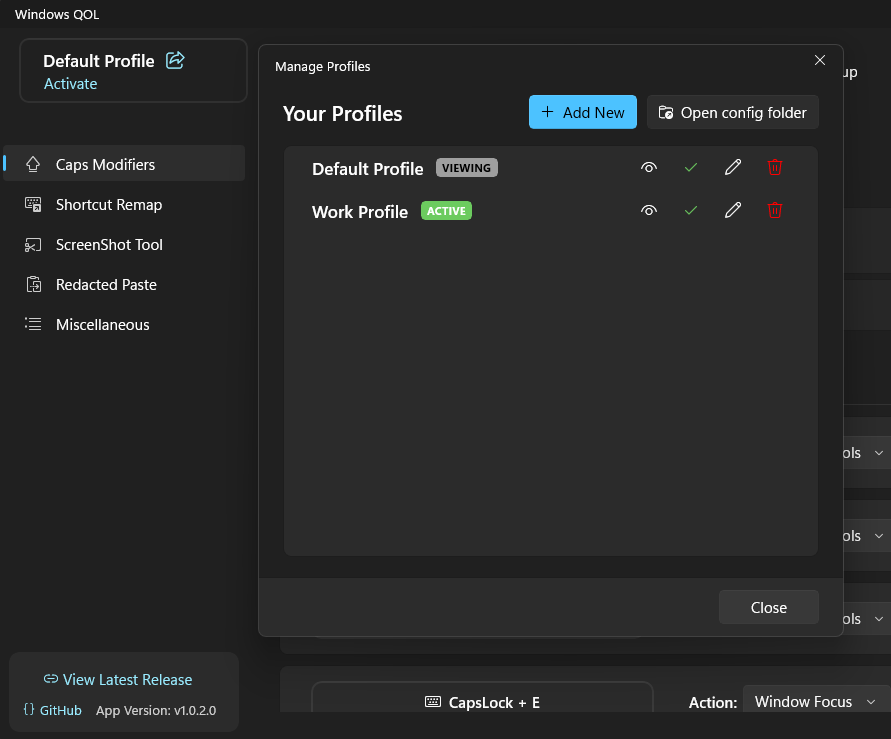
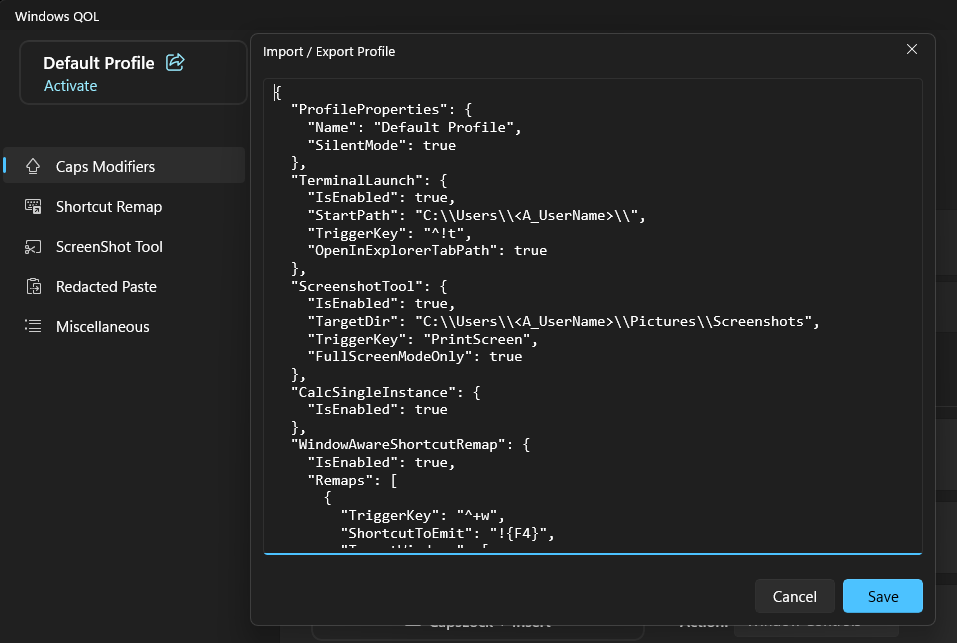
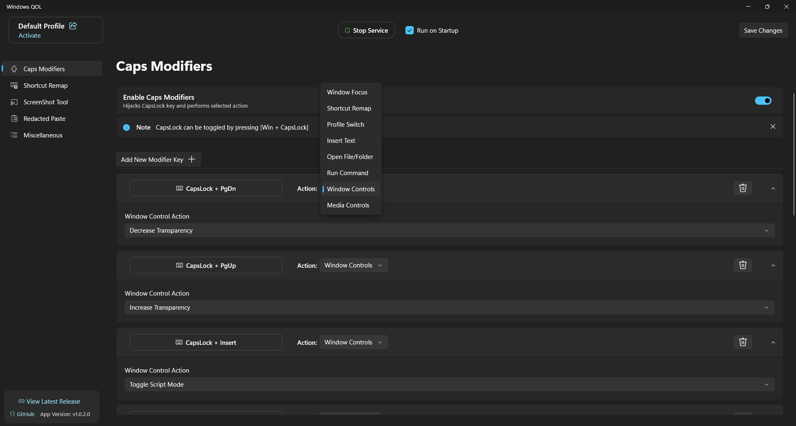
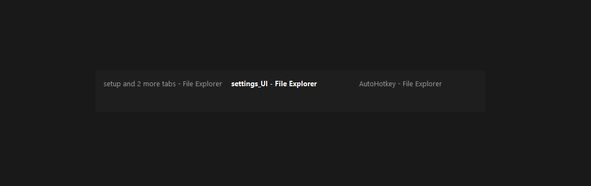
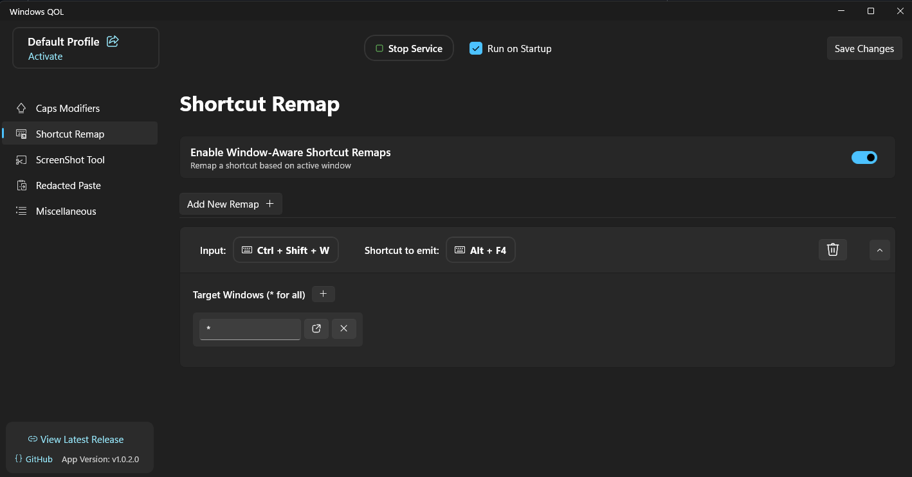
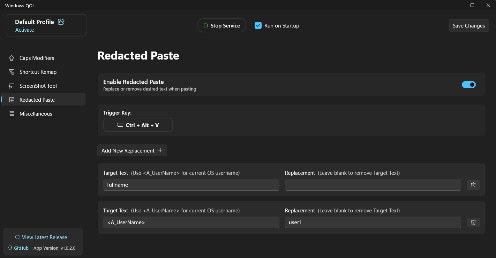
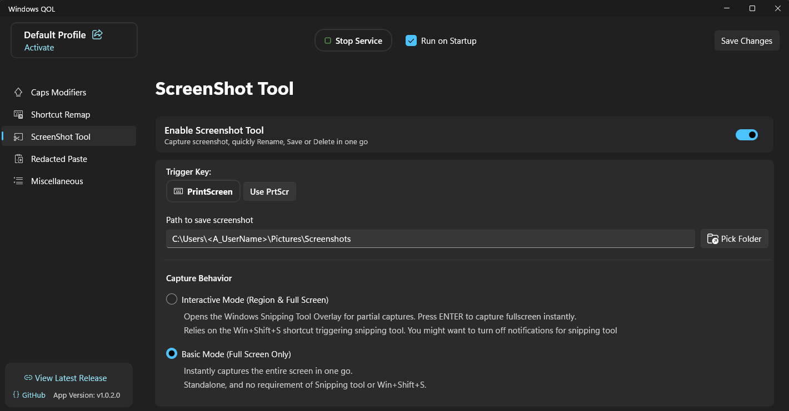
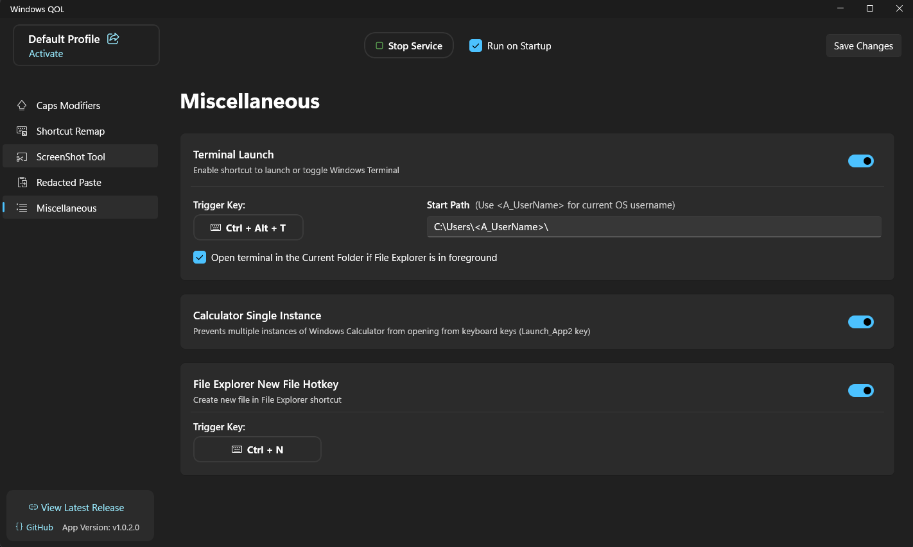
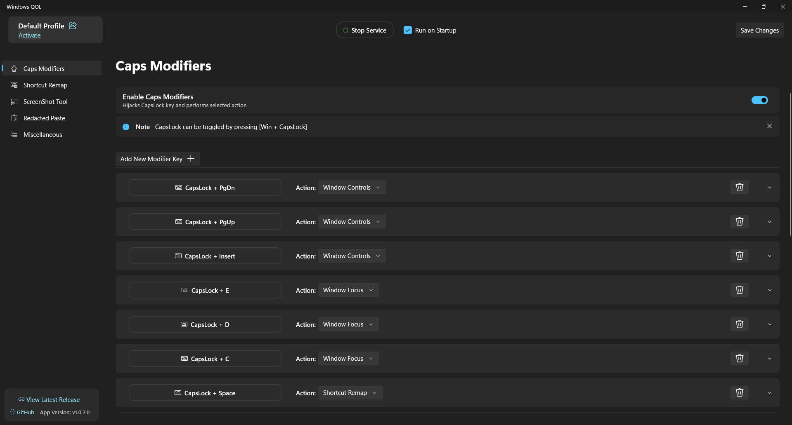
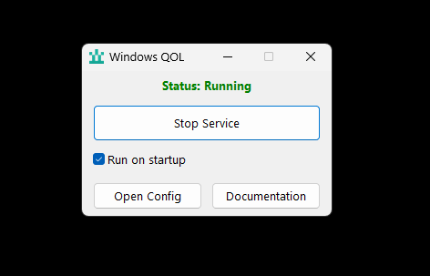

# Windows QOL

Windows QOL is a Windows desktop utility built around AutoHotkey.

It includes Caps Lock modifiers, window switching, shortcut remapping, screenshot capture, terminal launching, profile management, and other keyboard-driven utilities.

Running in background, uses **<2.6 MB** of RAM.

For Installation refer: [Installation](#installation)

For Default Behavior refer: [Default Profile](#default-config-behavior)

<br>

For JSON format refer:
[Config.md](ahk_service/config.md)

For sample JSON refer:
[config.json](ahk_service/config.json)


# Feature Overview

## Profiles

Create multiple independent profiles and switch between them either with hotkey or manually
<p align="center">
  
</p>


Import and export profiles
<p align="center">
  
</p>

## Caps Modifiers

Use **Caps Lock** as the modifier key to trigger different actions.

<p align="center">
  
</p>


<p align="center">
  
  </br>
  <span>Minmal Alt+Tab like GUI for Action: Window Focus when there are multiple target windows</span>
</p>

### Supported actions:

- **Insert Text**: Insert predefined text into the active application.
- **Open File, Folder or URL**: Open a file, folder or URI using its default or a specified application.
- **Profile Switch**: Switch to another profile using a hotkey.
- **Run Command**: Launch applications, run commands, or open URIs.
- **Shortcut Remap**: Emit a different shortcut depending on the active window.
- **Window Focus**: Focus an open window, filter by window titles, display a custom `Alt + Tab` style menu for multiple matches, or launch an application if no matching window is found.
- **Window Controls**: Perform common window management actions.
  - Window Transparency control
  - Pin Window on Top
  - Mouse Click Through
  - **Script Mode** (More on script mode [here](ahk_service/config.md#togglescriptmode))
- **Media Controls** *(Volume, Mute, Previous, Next, Play/Pause)*: Control system media playback and volume.

<br>

### Examples
`Caps + E` can be mapped to **Window Focus** to focus File Explorer if it is already open or launch it otherwise.

`Caps + C` Open or Focus chrome with required title as _Gmail_ only window with Gmail tab will open, else run a command to open Gmail.

`Caps + F2` Switch to Profile 2 with compeltely different set of all remappings.

`Caps + Space` can go up one Folder in file explorer, open Terminal in VS Code, or open dev tools in browsers.

`Caps + 1/2/3` paste predefined snippets, signatures

`Caps + MouseButtons` use it to avoid hand movements across mouse and keyboard

- `Caps + LeftButton` to Enter or Esc to quickly dismiss dialogue boxes
- `Caps + RightButton` to Delete
- `Caps + Forward/Back Button` to switch virtual dekstops, undo/redo, copy/paste, tabs forward backward depending on which app is in the foreground
- `Caps + MouseWheel` set it to scroll tabs, switch virtual desktops, volume control.


Likewise, any `Caps + {Key}` can be assigned to one of the supported actions.

<br>

## Window Aware Shortcut Remapping

Assign different behavior to the same shortcut depending on the foreground application.

<p align="center">
  
</p>

**Example:** `Ctrl + Space` can send `Alt + Enter` in File Explorer while sending a different shortcut in another application.

Or remap `Ctrl + Shift + W` to `Alt + F4` across all applications.

## Redacted Paste

Remove unwanted keywords from text when pasting.

<p align="center">
  
</p>

**Example:** Replace `yourname` with `demo_name` when pasting clipboard contents.

## Screenshot Tool

Capture a screenshot, discard it, rename it, save it to a configured folder in one go.

<p align="center">
  
</p>

<p align="center">


https://github.com/user-attachments/assets/77a63a28-faae-4be4-ac12-fb62c39ba58c

  <span>Taking screenshot renaming it and saving it in custom folder</span>
</p>

## Terminal Launch

Launch a terminal with a predefined starting directory.

**Example:** Open Windows Terminal directly in `C:\Projects`.

## Calculator Single Instance

Prevents multiple Calculator windows from opening when using the keyboard's dedicated Calculator (`LaunchApp2`) key.

## File Explorer New File Hotkey

Quickly create a new file in file explorer


https://github.com/user-attachments/assets/9d6fc397-8cca-48f1-97f7-24493f8a3b7a

---

<br>

<p align="center">
  
  </br>
  <span>Calculator Single Instance and Terminal Launch and file explorer create new file</span>
</p>

# Installation

Windows QOL can be used in two ways depending on how you want to manage the configuration.

> [!note]
> For full functionality install it in the `Program Files` folder.
>
> This is required to capture and emit shortcuts on top of system or elevated applications.

Checkout [Releases](https://github.com/sedecillion/Windows_QOL/releases/) or read below

## Full Installation

Includes the AutoHotkey background service and the WinUI 3 settings application.

<p align="center">
  
  </br>
</p>

The settings application can be used to:

- Create and manage profiles.
- Configure all supported features.
- Import or export the current profile by copying or pasting its JSON.
- Edit the configuration without manually modifying `config.json`.
- Manage startup behavior.
- Start or stop the background service.

Download: [WindowsQOL-Full-v1.0.0.0.exe](https://github.com/sedecillion/Windows_QOL/releases/download/v1.0.0.0/WindowsQOL-Full-v1.0.0.0.exe)
## Minimal Installation

Includes the AutoHotkey background service and a lightweight management application.

<p align="center">
  
  </br>
</p>

The minimal application can:

- Enable or disable startup.
- Start or stop the background service.
- Open `config.json`.
- Open this README.

Feature configuration is performed by manually editing `config.json`.

See the notes below for the configuration format.

Download: [WindowsQOL-Minimal-v1.0.0.0.exe](https://github.com/sedecillion/Windows_QOL/releases/download/v1.0.0.0/WindowsQOL-Minimal-v1.0.0.0.exe)

# Important Notes

The configuration file is located at

```
%appdata%\Windows_QOL\config.json
```

Refer JSON Format: [Config.md](/ahk_service/config.md)

Sample JSON Config: [config.json](/ahk_service/config.json)


## Default Config Behavior

The default profile in the Full and Minimal versions is configured with the following shortcuts.

You can modify the default profile or create additional profiles to match your workflow.

#### General

`Ctrl + Alt + T`
- Opens Windows Terminal in `C:\Users\<A_UserName>\`
- If inside file explorer opens a terminal in that current folder

`PrintScreen`
- Takes screenshot and asks for filename and whether to save or discard screenshot

`Ctrl + Shift + W`
- Closes the active window (`Alt + F4`)

`Ctrl + Alt + V`
- Pastes clipboard text after applying Redacted Paste replacements
- Default replacements:
  - `fullname` → *(empty)*
  - `<A_UserName>` → `user1`

`Ctrl + N` and Inside File explorer
  - Create new file dialogue

---

#### Caps Modifiers

##### Window Focus

`Caps + E`
- Focus File Explorer if already open, otherwise launch it

`Caps + D`
- Focus Notepad if already open, otherwise launch it

`Caps + C`
- Focus Calculator if already open, otherwise launch it

---

##### Context Aware Shortcut Remaps

`Caps + Space`
- File Explorer → `Alt + Enter` (Properties)
- Notepad → `F5` (Insert current date and time)
- Microsoft Edge / Google Chrome → `F12` (Developer Tools)

`Caps + R`
- Opens the Run dialog (`Win + R`)

`Caps + Left Mouse Button`
- Emits `Enter`

`Caps + Right Mouse Button`
- Emits `Delete`

`Caps + Middle Mouse Button`
- Opens Task Manager (`Ctrl + Shift + Esc`)

`Caps + Mouse Wheel Up`
- VS Code → `Ctrl + PgUp` (Previous editor tab)
- Other applications → `Ctrl + Shift + Tab`

`Caps + Mouse Wheel Down`
- VS Code → `Ctrl + PgDn` (Next editor tab)
- Other applications → `Ctrl + Tab`

`Caps + Back Mouse Button (XButton1)`
- Switch to the virtual desktop on the left (`Ctrl + Win + Left`)

`Caps + Forward Mouse Button (XButton2)`
- Switch to the virtual desktop on the right (`Ctrl + Win + Right`)

---

##### Insert Text

`Caps + 1`
- Inserts:
  ```
  demo_user@example.com
  ```

---

##### Run Command / Open File

`Caps + Numpad1`
- Opens the Windows Available Wi-Fi Networks flyout

`Caps + Numpad2`
- Opens:
  ```
  C:\Users
  ```

`Caps + Numpad3`
- Runs a sample command demonstrating the Run Command action

---

##### Window Controls

`Caps + PgUp`
- Increase transparency of the active window

`Caps + PgDn`
- Decrease transparency of the active window

`Caps + Insert`
- Toggle Script Mode for the active window
  - Allows mouse clicks to pass through the window while keeping it pinned on top and making it transcluscent.


<br>

> [!warning]
>
> When the Caps Modifier feature is enabled, standard Caps Lock functionality is disabled. To toggle Caps Lock, press `Win + CapsLock`.

> [!note]
>
> To exit the background service press `Win + Escape`. This immediately stops all features and releases all keyboard hooks.
>
> To reload the background service press `Ctrl + Alt + Shift + Escape`.

# Info

The core functionality is built using [AutoHotkey](https://www.autohotkey.com/).

The Full Installation includes a [WinUI 3](https://learn.microsoft.com/en-us/windows/apps/winui/winui3/) settings application for configuring the runtime without manually editing the configuration file.
