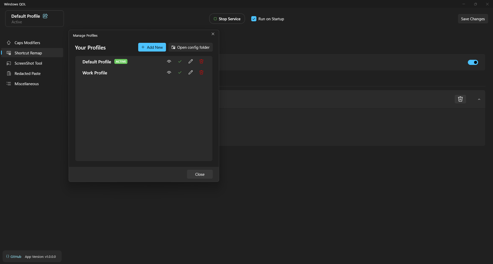
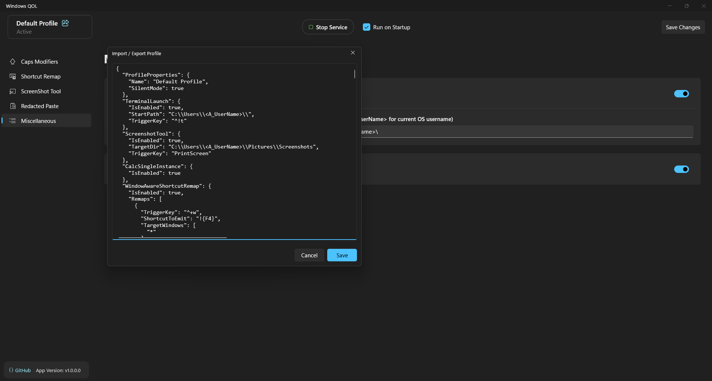
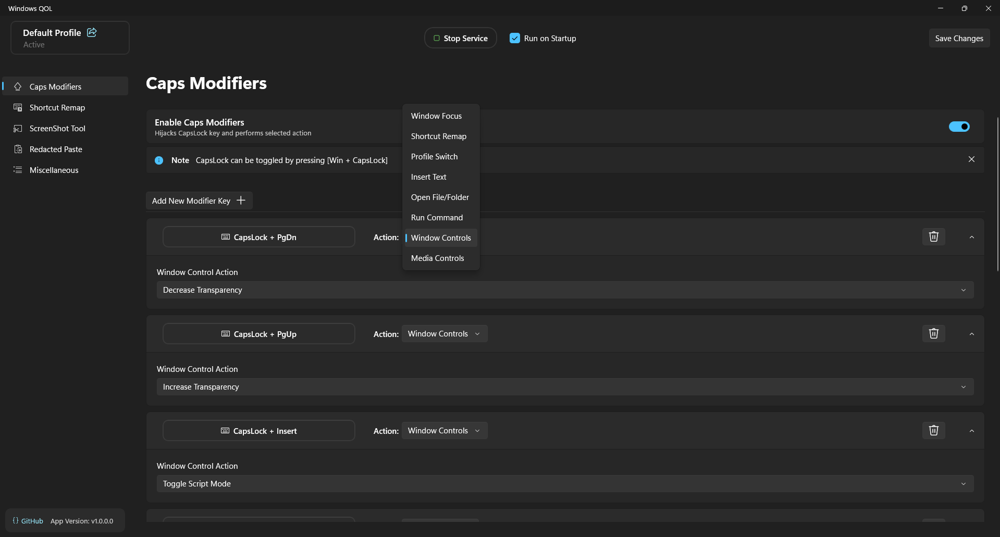
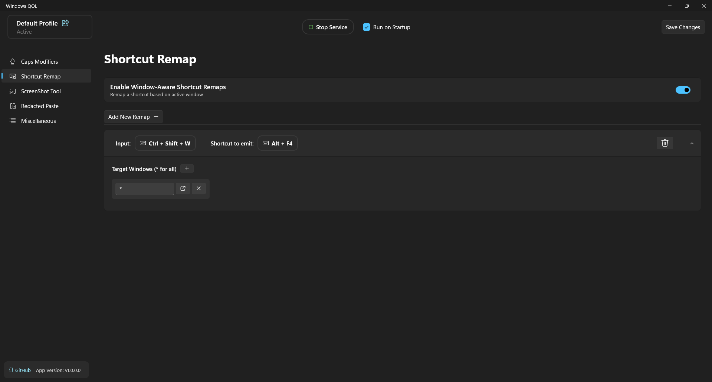
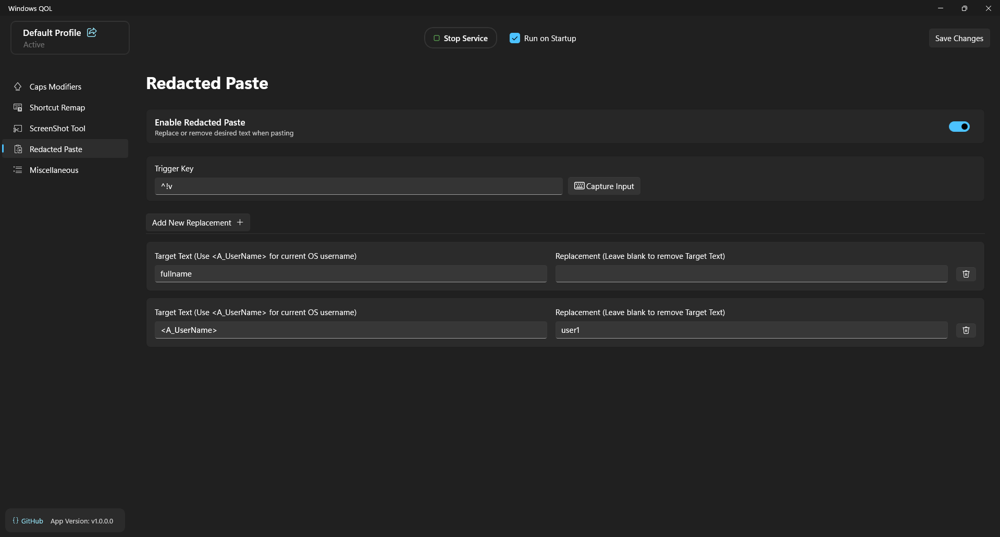
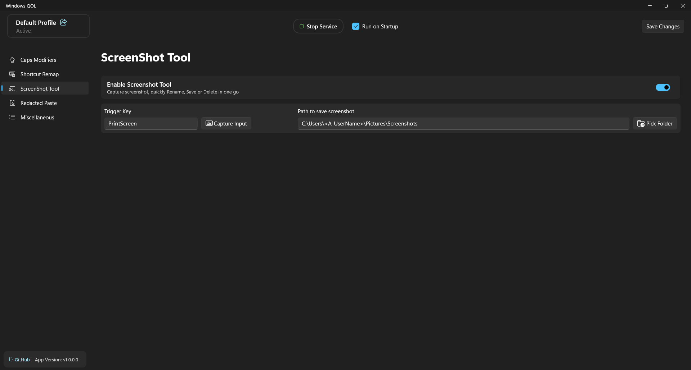
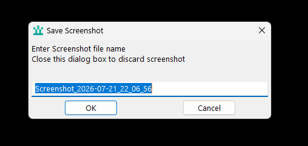
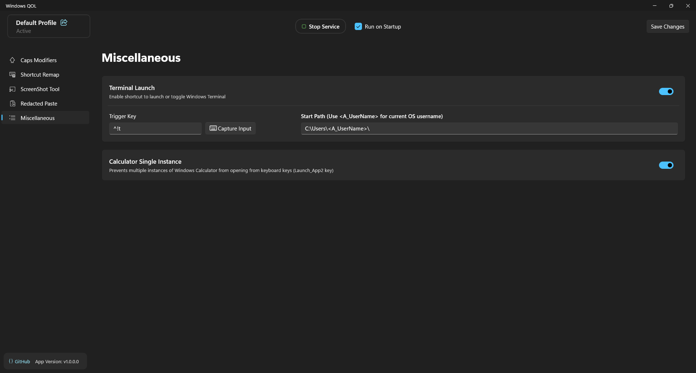
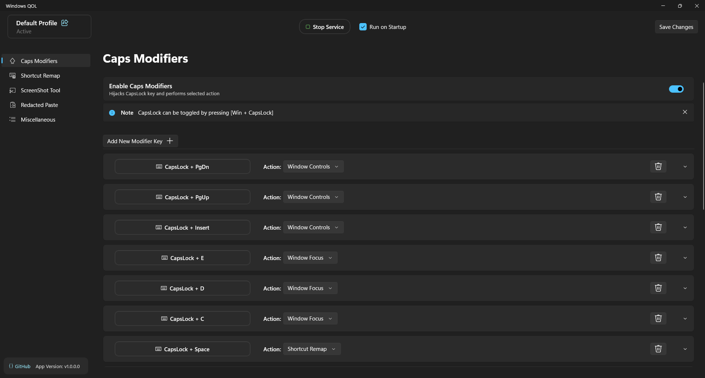

# Windows QOL

Windows QOL is a Windows desktop utility built around AutoHotkey.

It includes Caps Lock modifiers, window switching, shortcut remapping, screenshot capture, terminal launching, profile management, and other keyboard-driven utilities.

Running in background, uses **<2.6 MB** of RAM.

For Installation refer:

- [Full Installation](#full-installation)

- [Minimal Installation](#minimal-installation)

For JSON format refer:
[Config](ahk_service/config.md)

For sample JSON refer:
[config.json](ahk_service/config.json)


# Feature Overview

## Profiles

Create multiple independent profiles and switch between them either with hotkey or manually
<p align="center">
  
</p>


Import and export profiles
<p align="center">
  
</p>

## Caps Modifiers

Use **Caps Lock** as the modifier key to trigger different actions.

<p align="center">
  
</p>


<p align="center">
  
  </br>
  <span>Minmal Alt+Tab like GUI for Action: Window Focus when there are multiple target windows</span>
</p>

Supported actions:

- **Insert Text** — Insert predefined text into the active application.
- **Open File, Folder or URL** — Open a file, folder or URI using its default or a specified application.
- **Profile Switch** — Switch to another profile.
- **Run Command** — Launch applications, commands, or URIs.
- **Shortcut Remap** — Emit a different shortcut depending on the active window.
- **Window Focus** — Focus an open window, apply filters, display a custom `Alt + Tab` style menu, or launch an application if no matching window is found.
- **Window Controls** *(Transparency, Pin on Top, Click Through, Script Mode)* — Perform common window management actions.
- **Media Controls** *(Volume, Mute, Previous, Next, Play/Pause)* — Control system media playback and volume.

**Example:** `Caps + E` can be mapped to **Window Focus** to focus File Explorer if it is already open or launch it otherwise.

Likewise, any `Caps + {Key}` can be assigned to one of the supported actions.

## Window Aware Shortcut Remapping

Assign different behavior to the same shortcut depending on the foreground application.

<p align="center">
  
</p>

**Example:** `Ctrl + Space` can send `Alt + Enter` in File Explorer while sending a different shortcut in another application.

Or remap `Ctrl + Shift + W` to `Alt + F4` across all applications.

## Redacted Paste

Remove unwanted keywords from text before pasting.

<p align="center">
  
</p>

**Example:** Replace `yourname` with `demo_name` before pasting clipboard contents.

## Screenshot Tool

Capture a screenshot, discard it, rename it, save it to a configured folder in one go.

<p align="center">
  
</p>

<p align="center">
  
  </br>
  <span>Dialog box after pressing trigger key</span>
</p>

## Terminal Launch

Launch a terminal with a predefined starting directory.

**Example:** Open Windows Terminal directly in `C:\Projects`.

## Calculator Single Instance

Prevents multiple Calculator windows from opening when using the keyboard's dedicated Calculator (`LaunchApp2`) key.


<p align="center">
  
  </br>
  <span>Calculator Single Instance and Terminal Launch</span>
</p>

# Installation

Windows QOL can be used in two ways depending on how you want to manage the configuration.

> [!note]
> For full functionality install it in the `Program Files` folder.
>
> This is required to capture and emit shortcuts on top of system or elevated applications.

Checkout [Releases](https://github.com/sedecillion/Windows_QOL/releases/) or read below

## Full Installation

Includes the AutoHotkey background service and the WinUI 3 settings application.

<p align="center">
  
  </br>
</p>

The settings application can be used to:

- Create and manage profiles.
- Configure all supported features.
- Import or export the current profile by copying or pasting its JSON.
- Edit the configuration without manually modifying `config.json`.
- Manage startup behavior.
- Start or stop the background service.

Download: [WindowsQOL-Full-v1.0.0.0.exe](https://github.com/sedecillion/Windows_QOL/releases/download/v1.0.0.0/WindowsQOL-Full-v1.0.0.0.exe)
## Minimal Installation

Includes the AutoHotkey background service and a lightweight management application.

<p align="center">
  
  </br>
</p>

The minimal application can:

- Enable or disable startup.
- Start or stop the background service.
- Open `config.json`.
- Open this README.

Feature configuration is performed by manually editing `config.json`.

See the notes below for the configuration format.

Download: [WindowsQOL-Minimal-v1.0.0.0.exe](https://github.com/sedecillion/Windows_QOL/releases/download/v1.0.0.0/WindowsQOL-Minimal-v1.0.0.0.exe)

# Important Notes

The configuration file is located at

```
%appdata%\Windows_QOL\config.json
```

Refer Format here: [config.json](/ahk_service/config.md)


> [!warning]
>
> When the Caps Modifier feature is enabled, standard Caps Lock functionality is disabled. To toggle Caps Lock, press `Win + CapsLock`.

> [!note]
>
> To exit the background service press `Win + Escape`. This immediately stops all features and releases all keyboard hooks.
>
> To reload the background service press `Ctrl + Alt + Shift + Escape`.

# Info

The core functionality is built using [AutoHotkey](https://www.autohotkey.com/).

The Full Installation includes a [WinUI 3](https://learn.microsoft.com/en-us/windows/apps/winui/winui3/) settings application for configuring the runtime without manually editing the configuration file.
